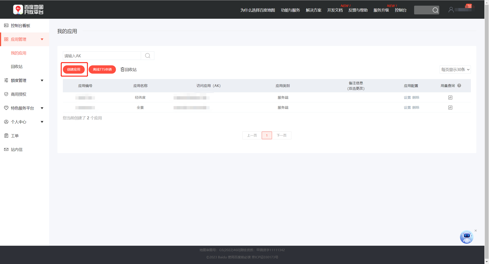
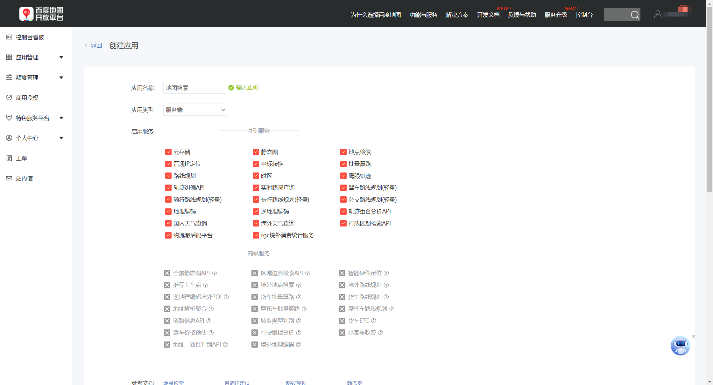
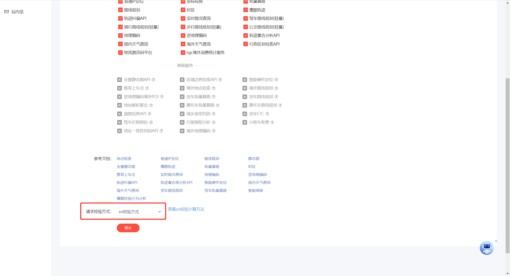

# 数据清洗获取最终训练数据
developer: 
- [hz157](https://github.com/hz157)
- [Uyoin](#)
---


## 支持库列表
``` bash
pip install -r requirements.txt
```
使用清华大学镜像源 Tsinghua University Mirrors
``` bash
pip install -r requirements.txt -i https://pypi.tuna.tsinghua.edu.cn/simple
```

## 提示
- **spacy语言包需手动安装**
``` bash
    python -m spacy download zh_core_web_trf
```
- Spacy使用GPU调用请取消 ner.py中的该行注释
``` python
# spacy.require_gpu()   # 使用GPU请取消该行注释
```

### 配置文件
可变更配置均在config/config.py文件中，修改[config/config.py](config/config.py)内的参数即可

### API

#### 百度Baidu
> 使用百度地图开放平台，使用前请先成为百度地图开放平台开发者申请个人Access Key（AK）<br>
> 申请地址:   https://lbsyun.baidu.com/apiconsole/key#/home

创建应用


---
配置应用的权限


---
更改IP白名单为SN校验方式

#### 腾讯Tencent (由于街景问题，停止使用该API）
> 使用腾讯位置服务

